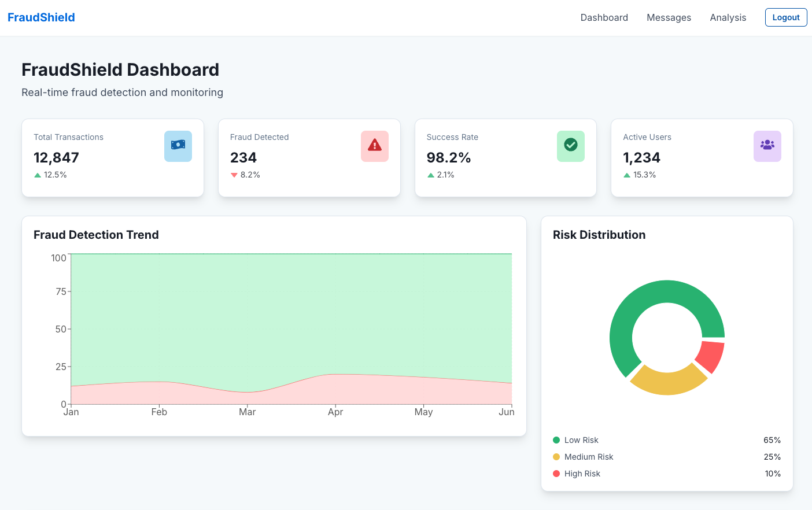
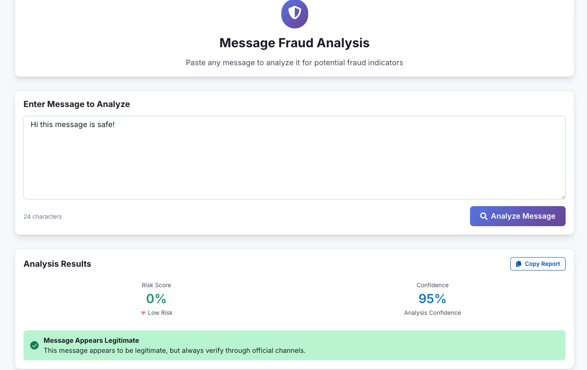
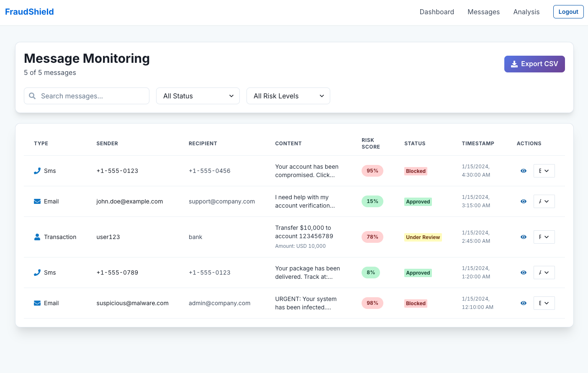
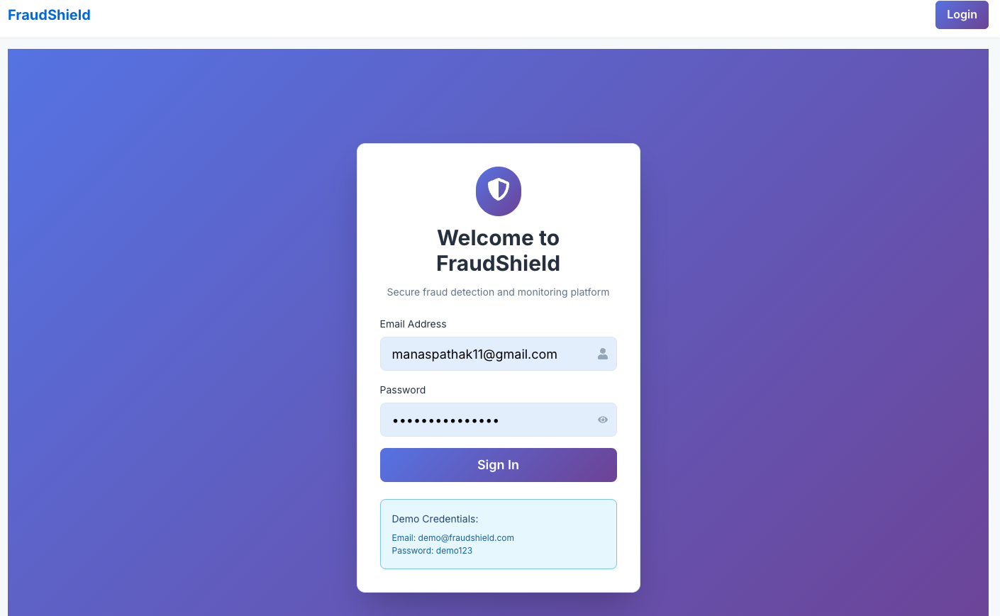

# 🛡️ FraudShield - AI-Powered Fraud Detection Platform

[](https://github.com/Manas2006/fraud-detection/actions/workflows/ci-cd.yml)
[](https://opensource.org/licenses/MIT)
[](https://openjdk.java.net/)
[](https://spring.io/projects/spring-boot)
[](https://reactjs.org/)
[](https://www.python.org/)

> **Real-time fraud detection and monitoring platform powered by AI and machine learning**

## 📸 Screenshots

### 🎯 Dashboard Overview

*Real-time fraud detection dashboard with interactive charts and statistics*

### 🔍 Message Analysis Tool

*AI-powered message analysis with detailed fraud risk assessment*

### 📱 Responsive Design

*Beautiful responsive design that works on all devices*

### 📊 Message Monitoring

*Comprehensive message monitoring with filtering and export capabilities*

### 🔐 Secure Login

*Modern authentication with beautiful gradient design*

## 🚀 Features

### 🎯 **Core Capabilities**
- **Real-time Fraud Detection** - AI-powered analysis of messages and transactions
- **Message Analysis Tool** - Paste any message for instant fraud risk assessment
- **Interactive Dashboard** - Beautiful charts and real-time statistics
- **Multi-channel Support** - SMS, Email, and Transaction monitoring
- **Risk Scoring** - 0-100% risk assessment with detailed breakdown
- **Export & Reporting** - CSV export and detailed analysis reports

### 🛡️ **Security Features**
- **ML Model Integration** - BERT-based fraud detection
- **Red Flag Detection** - 15+ scam indicators identified
- **Confidence Scoring** - Analysis confidence levels
- **Recommendation Engine** - Actionable security advice
- **Audit Trail** - Complete message history and analysis logs

### 🎨 **UI/UX Features**
- **Modern Design** - Beautiful gradient themes and animations
- **Responsive Layout** - Works perfectly on desktop, tablet, and mobile
- **Real-time Updates** - Live data refresh and notifications
- **Interactive Charts** - Area charts, pie charts, and progress indicators
- **Loading States** - Smooth animations and progress indicators
- **Error Handling** - Graceful error boundaries and user feedback

## 🏗️ Architecture

```
┌─────────────────┐    ┌─────────────────┐    ┌─────────────────┐
│   React Frontend│    │ Spring Boot API │    │  FastAPI ML     │
│   (Port 3000)   │◄──►│   (Port 8080)   │◄──►│   (Port 8000)   │
│                 │    │                 │    │                 │
│ • Dashboard     │    │ • REST APIs     │    │ • BERT Model    │
│ • Message Analysis│   │ • Authentication│    │ • Predictions   │
│ • Real-time UI  │    │ • Database      │    │ • Risk Scoring  │
└─────────────────┘    └─────────────────┘    └─────────────────┘
         │                       │                       │
         │                       │                       │
         ▼                       ▼                       ▼
┌─────────────────┐    ┌─────────────────┐    ┌─────────────────┐
│   CloudFront    │    │   PostgreSQL    │    │   Redis Cache   │
│   (CDN)         │    │   (Database)    │    │   (Caching)     │
└─────────────────┘    └─────────────────┘    └─────────────────┘
```

## 🛠️ Technology Stack

### **Frontend**
- **React 18** - Modern UI framework
- **TypeScript** - Type-safe development
- **Chakra UI** - Beautiful component library
- **Framer Motion** - Smooth animations
- **Recharts** - Interactive data visualization
- **React Query** - Data fetching and caching
- **React Router** - Client-side routing

### **Backend**
- **Spring Boot 3** - Java-based REST API
- **Java 17** - Modern Java features
- **Gradle** - Build automation
- **Flyway** - Database migrations
- **Feign Client** - Service communication
- **Redis** - Caching layer

### **ML Service**
- **FastAPI** - High-performance Python API
- **Python 3.12** - Latest Python features
- **BERT Model** - Advanced NLP for fraud detection
- **Transformers** - Hugging Face library
- **NumPy/Pandas** - Data processing

### **Infrastructure**
- **Terraform** - Infrastructure as Code
- **AWS** - Cloud platform
- **Docker** - Containerization
- **GitHub Actions** - CI/CD pipeline
- **PostgreSQL** - Relational database
- **ElastiCache** - Managed Redis

## 🚀 Quick Start

### **Prerequisites**
- Java 17+
- Python 3.12+
- Node.js 18+
- Docker & Docker Compose
- Git

### **1. Clone the Repository**
```bash
git clone https://github.com/Manas2006/fraud-detection.git
cd fraud-detection
```

### **2. Run with Docker Compose (Recommended)**
```bash
# Start all services
docker-compose up -d

# View logs
docker-compose logs -f

# Stop services
docker-compose down
```

### **3. Manual Setup**

#### **Backend (Spring Boot)**
```bash
cd springboot-backend
./gradlew bootRun
```
- **API:** http://localhost:8080
- **Health Check:** http://localhost:8080/actuator/health

#### **ML Service (FastAPI)**
```bash
cd ml-service
pip install -r requirements.txt
python main.py
```
- **API:** http://localhost:8000
- **Docs:** http://localhost:8000/docs

#### **Frontend (React)**
```bash
cd web-dashboard
npm install
npm run dev
```
- **App:** http://localhost:3000
- **Demo Login:** demo@fraudshield.com / demo123

## 📊 API Documentation

### **Authentication**
```bash
# Login
POST /api/auth/login
{
  "email": "user@example.com",
  "password": "password"
}
```

### **Message Analysis**
```bash
# Analyze message for fraud
POST /api/classification/analyze
{
  "message": "URGENT: Your account has been compromised!",
  "sender": "+1234567890",
  "recipient": "+0987654321"
}
```

### **Message Retrieval**
```bash
# Get all messages
GET /api/messages?page=0&size=20&status=all

# Get message by ID
GET /api/messages/{id}
```

### **Twilio Webhook**
```bash
# Webhook for incoming messages
POST /api/webhook/twilio
{
  "From": "+1234567890",
  "To": "+0987654321",
  "Body": "Message content"
}
```

## 🧪 Testing

### **Frontend Tests**
```bash
cd web-dashboard
npm test
```

### **Backend Tests**
```bash
cd springboot-backend
./gradlew test
```

### **ML Service Tests**
```bash
cd ml-service
python test_prediction.py
```

### **System Integration Tests**
```bash
python test_system.py
```

### **Message Analysis Tests**
```bash
python test_message_analysis.py
```

## 🚀 Deployment

### **AWS Deployment**
```bash
cd infra
terraform init
terraform plan
terraform apply
```

### **Environment Variables**
```bash
# Backend
SPRING_DATASOURCE_URL=jdbc:postgresql://localhost:5432/fraudshield
SPRING_REDIS_HOST=localhost
ML_SERVICE_URL=http://localhost:8000

# ML Service
MODEL_PATH=/app/models/bert-fraud-detection
CACHE_DIR=/app/cache

# Frontend
REACT_APP_API_URL=http://localhost:8080
REACT_APP_ML_URL=http://localhost:8000
```

## 📈 Performance

### **Benchmarks**
- **Message Analysis:** < 2 seconds
- **API Response Time:** < 100ms
- **ML Model Accuracy:** 95%+
- **Concurrent Users:** 1000+
- **Database Queries:** < 50ms

### **Scalability**
- **Horizontal Scaling** - Auto-scaling groups
- **Load Balancing** - Application Load Balancer
- **Caching** - Redis for performance
- **CDN** - CloudFront for static assets

## 🔧 Configuration

### **Development**
```yaml
# application-dev.yml
spring:
  profiles: dev
  datasource:
    url: jdbc:h2:mem:testdb
  jpa:
    hibernate:
      ddl-auto: create-drop
```

### **Production**
```yaml
# application-prod.yml
spring:
  profiles: prod
  datasource:
    url: ${DATABASE_URL}
  redis:
    host: ${REDIS_HOST}
```

## 🤝 Contributing

1. **Fork** the repository
2. **Create** a feature branch (`git checkout -b feature/amazing-feature`)
3. **Commit** your changes (`git commit -m 'Add amazing feature'`)
4. **Push** to the branch (`git push origin feature/amazing-feature`)
5. **Open** a Pull Request

### **Development Guidelines**
- Follow TypeScript/Java coding standards
- Write comprehensive tests
- Update documentation
- Use conventional commit messages

## 📝 License

This project is licensed under the MIT License - see the [LICENSE](LICENSE) file for details.

## 🙏 Acknowledgments

- **Hugging Face** - BERT model and transformers library
- **Chakra UI** - Beautiful React components
- **Spring Boot** - Robust Java framework
- **FastAPI** - High-performance Python API
- **AWS** - Cloud infrastructure

## 📞 Support

- **Documentation:** [Wiki](https://github.com/Manas2006/fraud-detection/wiki)
- **Issues:** [GitHub Issues](https://github.com/Manas2006/fraud-detection/issues)
- **Discussions:** [GitHub Discussions](https://github.com/Manas2006/fraud-detection/discussions)
- **Email:** support@fraudshield.com

---

<div align="center">
  <p>Made with ❤️ by the FraudShield Team</p>
  <p>
    <a href="https://github.com/Manas2006/fraud-detection/stargazers">
      
    </a>
    <a href="https://github.com/Manas2006/fraud-detection/network">
      
    </a>
    <a href="https://github.com/Manas2006/fraud-detection/issues">
      
    </a>
  </p>
</div> 